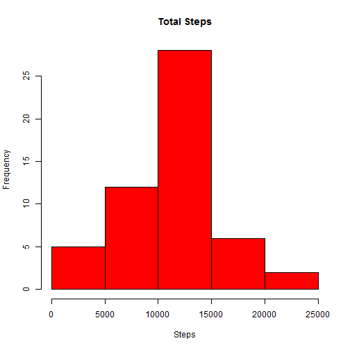
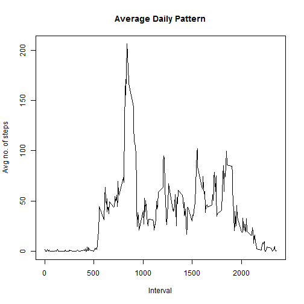
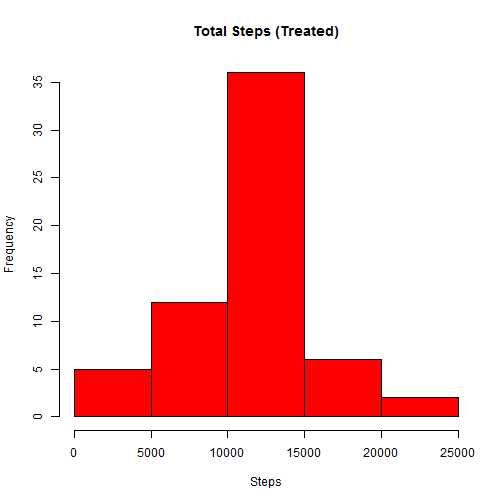
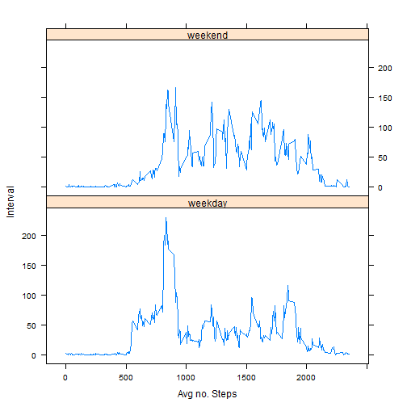

**Loading and preprocessing the data**

```r
#Read Data
setwd("C:/Users/Sravan/OneDrive/Data Science Masters/Coursera/Reproducible Research/Week II/Assignment/repdata-data-activity")
#unzip("activity.zip")
data<-read.csv("activity.csv")
```

**What is mean total number of steps taken per day?**


```r
#Mean total steps in a day
mean(data$steps[!is.na(data$steps)])
```

```
## [1] 37.3826
```

```r
#Total number of steps taken each day

clean_data<-data[complete.cases(data),]
agg<-aggregate(clean_data$steps, by=list(clean_data$date),sum)
hist(agg$x,main = "Total Steps",col="red",xlab = "Steps")
```

 

Mean and Median of total steps per day


```r
mean(agg$x) #Mean
```

```
## [1] 10766.19
```

```r
median(agg$x) #Median
```

```
## [1] 10765
```

**What is the average daily activity pattern?**


```r
agg1<-aggregate(clean_data$steps,by=list(clean_data$interval),FUN=mean)
plot(agg1$Group.1,agg1$x,type = "l",ylab = "Avg no. of steps",xlab="Interval",main="Average Daily Pattern")
```

 

```r
maxint=agg1[which(agg1$x==max(agg1$x)),1]
```
835 5-minute interval has maximum number of steps


```r
mv<-sum(sum(complete.cases(data)))
```
Total number of missing values in the data are 15264


**Imputing missing values**


```r
# create another dataset to impute missing values #
new_activity <- data

# calculate average steps taken by 5-min interval, across all days #
avgsteps_perinterval <- new_activity %>%  # dplyr package is needed
                        group_by(interval) %>%
                        summarise(avg_steps = mean(steps, na.rm = TRUE))
# avgsteps_perinterval has two columns: interval and avg_steps

# find the index of missing values #
index_of_na <- which(is.na(new_activity$steps)) 

# the for-loop below replaces NA in variable 'steps' of data frame new_activity (given the index_of_na) with the value of variable 'avg_steps', corresponding to the same interval in both data frames.
for (i in index_of_na) {
    new_activity$steps[i] <- with(avgsteps_perinterval, 
                                  avg_steps[interval == new_activity$interval[i]])
}
```

```r
#Plotting histogram and finding mean and median
agg2<-aggregate(new_activity$steps, by=list(new_activity$date),sum)
hist(agg2$x,main = "Total Steps (Treated)",col="red",xlab = "Steps")
```

 

```r
mean1<-mean(agg2$x)
median2<-median(agg2$x)
```
Mean is 1.0766189 &times; 10<sup>4</sup> and median is 1.0766189 &times; 10<sup>4</sup>. The values do not change much. There
is no impact of treating the missing values on mean and median

**Are there differences in activity patterns between weekdays and weekends?**


```r
weekday<-weekdays(as.Date(new_activity$date))
new_activity1<-cbind(new_activity,weekday)
new_activity2<-sqldf("select *,(case when weekday in ('Saturday','Sunday') then 1 else 0 end) as weekgflag from new_activity1")
```


```r
new_activity2$weekgflag<-factor(new_activity2$weekgflag, labels=c("weekday","weekend"))
agg5<-aggregate(new_activity2$steps, by=list(new_activity2$weekgflag,new_activity2$interval),FUN=mean)
xyplot(agg5$x~agg5$Group.2|agg5$Group.1 ,data = new_activity2,type = "l", layout=c(1,2), xlab = "Avg no. Steps",ylab = "Interval")
```

 


